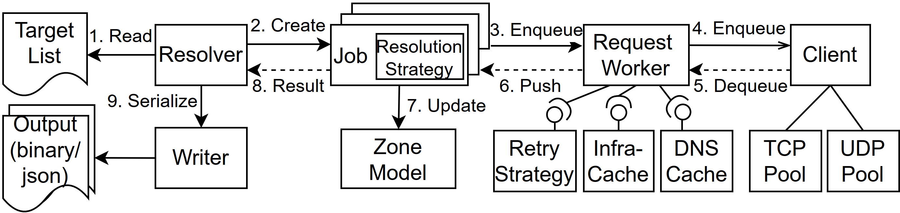

# Overview

yodns is a DNS resolver tool for exploring the full DNS tree over all name servers.
It is designed specifically for Internet-scale measurements.

- If you are curious and want to try out yodns, go to [Getting Started](#getting-started)
- If you want to use yodns for a large scale scan, go to [Run large scale measurements](#run-large-scale-measurements)
- If you downloaded our dataset and want to know how to process it, go to [Data Sets](#data-sets)
- If you want to learn about the details, contribute code or adapt yodns to your needs, maybe you want to start with [Project Structure](#project-structure)

# Getting Started

To get started with yodns, you need to have [go](https://go.dev/) installed.
You can build yodns by running the following commands

> cd yodns; go build

The [makefile](makefile) contains some useful example to get you started.
You will need to install `make` and `parallel`.
Running 

> make my_experiment

will run a minimal experiment that resolve a domain and counts the number of dependencies for the encountered zones.
To run this, you will need IPv4 and IPv6 connectivity.
Note, that the resolution may take a while due to a conservative retry policy.

# Project Structure 

The project consists of three modules:
- `client` is the implementation of an asynchronous, rate-limiting and high-throughput DNS client based on the popular [miekg DNS library](https://github.com/miekg/dns)
- `resolver` is the module, containing our domain model and all the (resolver-) logic to do DNS measurements.
- `yodns` is our command line interface and contains commands to run scans or evaluate results.

In general, there are some principles which we tr to adhere to, and which may explain why some things are implemented the way they are.

- async all the way down
- be nice to others' infrastructure
- gather everything: collect all the records we can get our hands on, because more data is better data
- be extensible: Nothing works for all use-cases so we need to provide the right extension points to tweak all important parts of the code.

## Client Module

The client module is an implementation of an asynchronous, rate-limiting and high-throughput DNS client.
It is based on the popular [miekg DNS library](https://github.com/miekg/dns),
but it is specifically tailored towards use in measurement experiments.

It is **asynchronous**, thus enabling high parallelization and performance while being comparably light on the CPU.

It supports **rate limiting**, allowing measurement tools to be respectful of the infrastructure of others.
So far, rate limiting is achieved by limiting the number of queries inflight and the number of queries inflight per IP.
Limiting the queries-per-second could be a useful extension for the future.

It supports **port reuse**, meaning each single, long-lived UDP port can communicate with multiple servers.
This allows for high-performance while being very moderate on the number of needed ports.
Ports are set up upfront, so only an initial cost (in terms of CPU) is paid.

**TCP connection pooling** and **TCP keepalive** ([RFC7828](https://www.rfc-editor.org/rfc/rfc7828.txt)) optimize the performance for TCP queries.


## Resolver Module

The following image gives an overview over the working of the 'resolver'.
It is a mixture of data-flows, structs, packages and more, so don't take it at face value.




# Data Sets

We share a dataset of 700 million domains name resolutions [here](https://doi.org/10.17617/3.UBPZXP).
For a description of the data format, see [Data Format](#data-format)

# Data Format

yodns can write and process binary and json formats.

Binary data is the most efficient format in terms of storage and processing.
It is recommended to use, especially for large scale scans.
JSON data is mostly for debugging and manual inspection and may not fully be supported for all operations.

## Conversion

yodns can convert between formats using the `convertFormat` command.

```bash
yodns convertFormat --in 'output_1.pb.zst' --out 'data/json' --size 10
```

Here, the `out` parameter specifies a directory, as one binary file may result in a *very* large JSON file.
Using `size`, we limit the number of entries that can be put into a JSON file, effectively splitting the input into multiple outputs.

## Binary

The binary format is the main format yodns.
We utilize [protobuf](https://protobuf.dev/) to encode messages.
Each file consists of a series of messages that typically encode multiple *resolutions*.
In order to allow parsing, we also need to store the number of length of the messages.

The format of a *resolution* is as follows
```
                                                  +-------------------------------------------+
                                                  | REPEATED for number of messages           |
+-------------------------------------------------+----------------------------+--------------+
|                     8 Bytes                     |          8 Bytes           |   x Bytes    |
+-------------------------------------------------+----------------------------+--------------+
| Count of proto messages that follow (BigEndian) | Length of the next message | Message Body |
+-------------------------------------------------+----------------------------+--------------+
```

**Explanation** 
- First, 8 bytes encode the number of protobuf messages to follow in BigEndian format.
- For each message, again 8 bytes encode the length of the next message (BigEndian), followed by the message itself.
- The first message is always of type `Resolution` and contains the view of the DNS tree that the resolver build during a resolution.
- All following messages are of type `MessageExchange` and encode a specific message that belong to this resolution
- Each binary file may contain multiple of these *resolutions*

The definition `Resolution` and `MessageExchange` can be found here: [Proto Definition](resolver/serialization/protobuf/protobuf_model.proto).
Using the protobuf compiler, code for encoding and decoding these messages can be generated for various languages.

For tutorials on how to use protobuf, see [here](https://protobuf.dev/).
For go, the commands below will generate the models for you.

```bash
cd resolver/serialization
protoc --go_out=. protobuf/protobuf_model.proto
```

In order to parse a file, you still need to build some wrapper around the generated file that first reads the message length,
then reads the message and decodes it using the generated protobuf code.
For go, this is implemented in our [protobuf package](resolver/serialization/protobuf).

### Why not just write one large protobuf message?

Having a single protobuf message with all the data for a resolution (or even multiple resolutions) would definitively be more convenient to parse.
However, there are certain drawbacks with this approach.
First, having smaller messages allows yodns to write the file incrementally during the scan, keeping less state in memory and reducing the memory footprint.
Second, many protobuf implementations are not able to handle messages larger than 2 GB - a resolution with a large number of messages may hit this limit.
Third, the protobuf implementation for python becomes seriously slow when encountering very long arrays.

So overall, the above format is beneficial in terms of performance and portability.

## Json

The JSON format corresponds to the binary format. 
It is **not recommended for serious scanning** as it requires much more space to store (even when compressed) and is slower to write and parse.
However, it can be a useful format for debugging and manual inspection.

Note, that changing values in the `Message` object may not lead to the desired result when parsing the JSON using yodns' `json/reader.go`.
This is because the reader will use `OriginalBytes` to reconstruct the DNS message - basically ignoring the changes done in `Message`.

# Linting

We use [golangci-lint](https://github.com/golangci/golangci-lint) for linting.


```bash

```
```powershell
golangci-lint run --path-prefix $(Get-Location)
```


# Working on Windows

Generally, we recommend working on Linux (especially for serious scanning).
However, most of the functionality is available on Windows as well.
That can be handy, if you just want to explore a bit :)

For interacting with the tool, use the command line interface.
Alternatively, you can add some convenience functions to the context menu by following the steps below:

```
reg import contextMenu.reg 
cd src\yodns; go install
```

You should now be able to call convenience function such as `Convert to JSON` on `zst` files created from yodns
and on .tar files.


# Monitoring

yodns can expose metrics via an prometheus HTTP endpoint.
Currently, authentication via basic-auth over HTTPS is supported.
To enable this, edit the `Metrics` config in the `runconfig.json`

```json5
{
  "Metrics": {
    "EndpointPort": 2112,
    "ServerCrtPath": "server.crt",
    "ServerKeyPath": "server.key",
    "PasswordChecksum": "16f78a7d6317f102bbd95fc9a4f3ff2e3249287690b8bdad6b7810f82b34ace3",
    "UserNameChecksum": "5e884898da28047151d0e56f8dc6292773603d0d6aabbdd62a11ef721d1542d8",
    "FilePath": "metrics.prom" // In addition to HTTPs, the latest metrics can be written to a local file.
  }
} 
```

First, you need create a key and a corresponding certificate for TLS and 
enter the paths in the `runconfig.json`

To create a self-signed one use (for example):

```bash
openssl genrsa 4096 > server.key
chmod 400 server.key
openssl req -new -x509 -nodes -sha256 -days 365 -key server.key -out server.crt
```

Next, we need a username and password for the basic auth.
In order to not store credentials in the configuration, yodns takes the hex-encoded SHA256 checksums instead of the plaintext values.

You can use the CLI to generate these values or calculate them via other means:
```bash
yodns hash -u "<username>" -p "<password>"
```

You should now be able to get the metrics using a prometheus client.

For using the provided dashboard, follow the steps below on the machine on which you want the monitoring.
Depending on your setup, you may want to run the monitoring on a different machine than the scan.

1. Edit the `monitoring/prometheus/prometheus.yml` to include the username and password you have chosen (plain text). 
If you use a self-signed certificate, you also need to set `insecure_skip_verify` to `true`. 
Alternatively, you can inject these values via docker environment variables.
2. [Optional] Change scrape configuration. Again, in the `prometheus.yml` edit the targets to include the scan machines that you want to monitor.
By default, prometheus will try to scrape from localhost:2112.
3. [Optional] Change grafana admin (**works on first startup only**). Edit the `monitoring/grafana/provisioning/grafana.env`, uncomment the `GF_SECURITY_ADMIN_USER` and `GF_SECURITY_ADMIN_PASSWORD`. If not set, the default admin (admin:admin) will be used.
4. [Optional] Run grafana on HTTPS. Set `GF_SERVER_PROTOCOL=https`, uncomment `GF_SERVER_CERT_KEY` and `GF_SERVER_CERT_FILE` and put the TLS certificate (`server.key` and `server.cert`) into `monitoring/grafana/provisioning` 
5. Run `docker-compose up` in the `monitoring` directory to start the monitoring stack.

You should be able to access grafana on localhost:3000 now. If, for some reason, the resolver dashboard is not showing, try importing via Dashboards>New>Import>Select the dashboard in `monitoring/grafana/provisioning/dashboards`. 

# Configuration

See [runconfig.json5](config/prod/runconfig.json5) for an example and [options.go](resolver/runner/options.go) for a description of the available parameters.

**Why this strange json5 format?**
Because a complex config benefits from explanatory comments and [json5](https://json5.org/) stops some IDEs from drawing squiggly red lines under each comment.

# Run large scale measurements

## Customize the runconfig

TODO: How to chose reaonsable parameters.

## File Limits 

Remove file limits on the scan machine or set in accordance to the number of ports you want to utilize.

## Randomize your input, use batch resolutions

If you hit the same servers too regularly, it can cause rate limiting. 
It will increase your scan time, or in the worst cause, cause timeouts. On the other hand, scanning domains that share labels in a single resolution is very beneficial in terms of result size, performance and cache hit ratio.

**Recommendation**: If your target list allows it, put batches (e.g. of size 20) of domains sharing the SLD together.
Then randomize the batches, in order to avoid hotspots.

## Do test runs to find good parameters for your setup

Performance can vary greatly and some input parameters can greatly diminish performance if chosen inappropriately.
Do test runs in order to find the best parameters for your setup.

[TBD] A list of heuristics and parameters which have strong impact.

### Parallelization, Latency and Throughput

- The tool is very latency sensitive.
- Raw bandwidth is typically not the bottleneck as many DNS queries are small
- The tool is inherently parallelizing the resolution so options.MaxParallelism does not need to be that high. A few hundreds should suffice.
- The better the latency, the less domains you need to resolve in parallel to saturate the CPU
- For higher latency, you want more parallel domains, (slightly) more CPU and increase the rate limit for queries inflight
    - However, this can only compensate so much. Better to improve latency.
- Number of hardware threads is controlled by the 'threads' parameter of the scan command. Not by the config.json.

### RAM and Cache

- The cache can be very RAM hungry. In fact, the largest part of RAM usage is typically due to the cache.
- As a rule of thumb, 1M cache entries need about 10GB of RAM.
- Setting the capacity is the best way to control RAM usage.
- How many cache entries do you want to have? This depends on your targets.
- But for on of our scans, the hit rate reached 94% with 2M entries and barely increased, even if the size is doubled or tripled.

**Recommendation**: Allocate 10GB of RAM + 10GB for every million entries you want to cache. Use maxMem to auto-throttle and avoid OOM kills

### Timeouts

- The long timeouts can be detrimental to the performance.
- Appropriate timeouts depend on your deployment
- Recommendation: Do a test scan with long timeouts, observe the query RTT in the dashboard and decide based on that

### ICMP

In order to use the ICMP functionality, the tool needs to be able to open raw-sockets

Run as root to give capability to open raw sockets:

>  setcap cap_net_raw=eip ./experiments

To remove:

>  setcap -r ./experiments


## Continue after crash